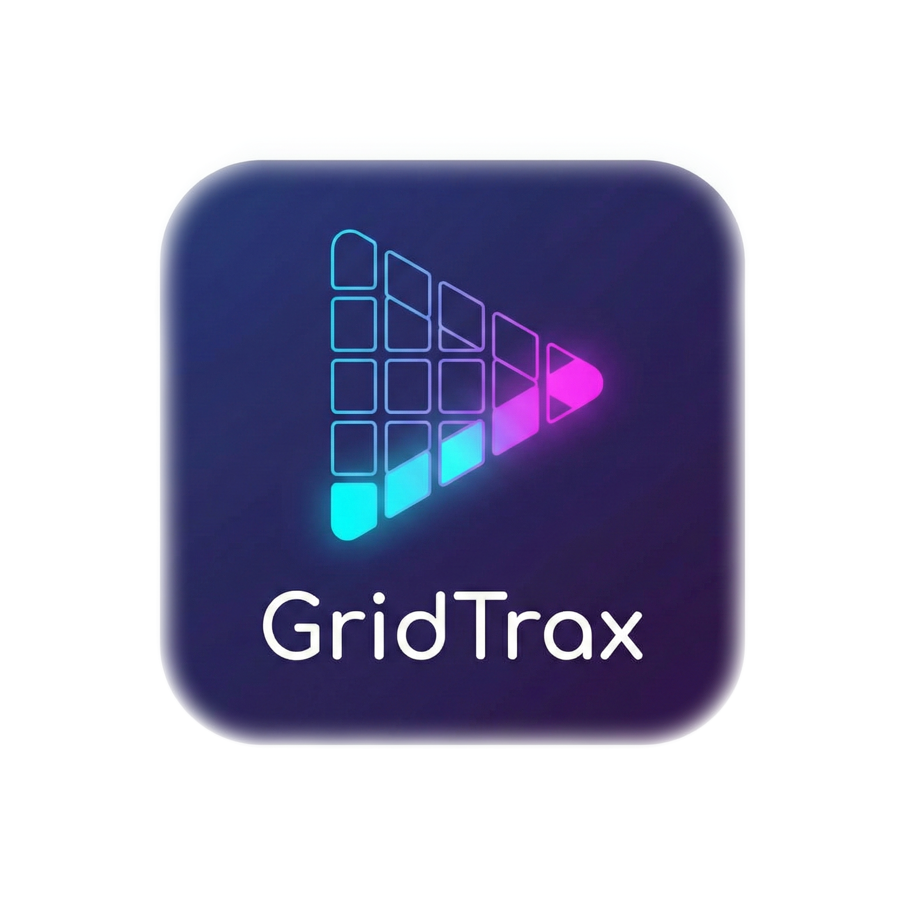

<div align="center">

# 🎬 GridTrax



**GridTrax** 是一个现代、精美且纯粹的前端私有影视剧集进度追踪应用。<br/>
不仅能像传统的看剧记录工具一样管理您的观影状态，还能以“网格化”（Grid）视图直观展示每一集的观看进度。

[](https://opensource.org/licenses/MIT)
[](https://react.dev/)
[](https://www.typescriptlang.org/)
[](https://vitejs.dev/)

</div>

---

## 🌟 项目动机

**GridTrax** 的核心灵感来源于广受好评的动漫二次元社区 [**Bangumi (番组计划)**](https://bgm.tv/)。

本项目作为一个轻量级的个人练习与自用工具，旨在探索一种不同的 UI 呈现方式与数据存储模式：

1. 🔲 **网格系统**：对于包含多季内容或数十集的剧集/动漫，尝试用直观的方块网格来分别呈现每一集的独立状态，像打卡一样记录单集看番进度。
2. 🚀 **纯前端架构**：由于仅作为个人记录工具，项目完全移除了后端服务依赖。所有的观影数据均保存在本地浏览器中。
3. 💾 **自带存储**：支持通过标准 WebDAV 协议（配合您的私有 NAS 或云盘工具）进行跨设备的数据同步，确保个人的追剧数据完全掌握在自己手中。

---

## ✨ 核心特性

- **Base46 动态主题**：内置多种精调的高级色彩主题（如 Ocean, Dracula, TokyoNight 等），随心切换。
- **海量数据源支持**：集成 [TMDB API](https://www.themoviedb.org/)，提供极其丰富的全球影视/动漫元数据。
- **集数网格**：为每一季的每一个单集生成独立网格，长按/点击即可轻松打卡。
- **私密同步**：原生支持浏览器跨域 WebDAV 同步，并提供 JSON 文件一键导入导出。
- **响应式设计**：流畅支持桌面端和移动端浏览的操作体验。

---

## 🛠️ 技术栈

| 类别       | 技术 / 框架 |
| ---------- | :--- |
| **框架**   | [React 19](https://react.dev/) + [TypeScript](https://www.typescriptlang.org/) |
| **构建**   | [Vite](https://vitejs.dev/) |
| **UI 组件** | [Material UI (MUI)](https://mui.com/) v7 |
| **状态管理**| [Zustand](https://zustand-demo.pmnd.rs/) (带 `persist` 持久化) |
| **网络请求**| 原生 `fetch` (WebDAV) / `Axios` (TMDB) |
| **色彩提取**| `colorthief` (智能提取海报主色调) |

---

## 🚀 部署与使用教程

这是一个纯前端 SPA 项目，构建产物为静态文件。可部署在任何静态托管服务（Vercel, Cloudflare Pages）、Docker 或 Node.js 环境中。

### 🔑 准备工作：获取 TMDB API Key

1. 注册并登录 [TMDB](https://www.themoviedb.org/)。
2. 进入 Account Settings → API，申请一个 API Key (v4 auth - API Read Access Token)。
3. 在项目根目录创建 `.env.local` 文件：
   ```env
   VITE_TMDB_BEARER=您的BearerToken
   ```

---

### 方式一：Cloudflare Pages 免费零代码部署

[](https://deploy.workers.cloudflare.com/?url=https://github.com/aronnaxlin/GridTrax)

#### 1. 连接 GitHub 仓库
1. 登录 [Cloudflare 控制台](https://dash.cloudflare.com/)。
2. 在左侧菜单中前往 **Workers & Pages**。
3. 点击 **Create application** -> **Pages** -> **Connect to Git**。
4. 选中您的 `GridTrax` Fork 仓库并点击继续。

#### 2. 配置构建参数
在“Set up builds and deployments”页面填写如下参数：
- **Framework preset**: `Vite` (若列表中没有，请选择 `None`)
- **Build command**: `npm run build`
- **Build output directory**: `dist`

#### 3. 部署并设置环境变量
1. 展开下方的 **Environment variables (advanced)**。
2. 添加变量：变量名为 `VITE_TMDB_BEARER`，值为您的 TMDB v4 Token。
3. 点击 **Save and Deploy**，不到两分钟您的专属 GridTrax 即可上线！

---

### 方式二：Docker 部署 (适合服务器/NAS 用户)

项目已针对 Docker 进行优化，支持一键部署到云服务器、群晖 NAS 等。镜像中**不包含**任何私密 Token，所有配置均在运行时动态注入。

#### 1. 使用 Docker Compose (最简单)

下载或创建 `docker-compose.yml` 并运行：

```yaml
services:
  gridtrax:
    image: aronnaxlin/gridtrax:latest
    container_name: gridtrax
    ports:
      - "721:721"
    environment:
      # 方式 A：直接指定环境变量 (推荐)
      - VITE_TMDB_BEARER=您的_TMDB_V4_TOKEN
    volumes:
      # 方式 B：通过挂载读取本地 .env.local 文件
      - ./.env.local:/app/.env.local:ro
    restart: always
```

直接启动：
```bash
docker compose up -d
```

> [!TIP]
> **方式 C**：你也可以在部署时不向环境注入任何 Token，直接在网页成功加载后，点击右上角【同步设置】中填入 Token 保存即可实时生效。

#### 2. 手动构建镜像或推送到 Docker Hub

```bash
# 构建镜像
docker build -t <your-username>/gridtrax:latest .

# 手动运行
docker run -d --name gridtrax -p 721:721 --restart unless-stopped <your-username>/gridtrax:latest
```

> [!NOTE]
> **关于安全性**：项目构建时，Token 会被置为安全占位符。容器启动时 `entrypoint.sh` 脚本则会自动将占位符替换为运行时环境变量中的真实值，因此您可以把镜像放心地推入 Docker Hub 等公共镜像仓库使用。

---

### 方式三：一键脚本部署 (Linux 环境)

```bash
chmod +x deploy.sh

./deploy.sh                  # HTTP 模式部署
./deploy.sh --ssl            # HTTPS 模式部署 (需要本机已配置前置条件)
./deploy.sh --port 8080      # 自定义端口
./deploy.sh --ssl --port 443 # HTTPS + 自定义端口
```

---

### 方式四：NPM 直接本地启动部署

无需 Docker，直接使用 Node.js（≥ 18）环境：

```bash
# 克隆并安装依赖
git clone https://github.com/yourusername/GridTrax.git
cd GridTrax
npm install

# 配置 .env.local (见上方准备工作)

# 开发模式运行
npm run dev

# 构建并启动静态服务 (端口运行于 721)
npm run serve
```

> ⚠️ 生成的 `dist/` 目录也可以直接托付给 Nginx / Apache / Caddy 等传统 Web 服务器静态代理。使用 Nginx 时请务必配置路由回退：`try_files $uri $uri/ /index.html;` 以兼容前端 SPA 动态路由。

---

## ☁️ 同步配置 (WebDAV)

由于 GridTrax 不自带后端，数据默认保存在浏览器的 LocalStorage 中（清除缓存会被清空）。若要安全保存并跨设备同步数据：

1. 点击导航栏右上角的 **"同步" (Sync)** 图标。
2. 填写您的 WebDAV 配置（推荐使用 [OpenList](https://github.com/OpenListTeam/OpenList) 挂载网盘，自带跨域支持）。
3. **注意：** 服务器**必须**支持并开启 CORS（跨域资源共享），否则浏览器会拒绝连接（坚果云原生不支持前端跨域，必须用 Alist 中转）。
4. 如果没有 WebDAV，您也可以使用面板中的 **导出 JSON / 导入 JSON** 功能进行手动备份。

---

## 🗺️ 发展计划

- [ ] **Bangumi 同步增强**：实现在 Bangumi 进行状态标记后，自动同步更新至 GridTrax。
- [ ] **拓展数据源支持**：计划新增对豆瓣（Douban）等网站的数据抓取与支持。
- [ ] **独立账号系统**：引入完善的用户管理系统，支持多端数据的高效云同步。
- [ ] **精细化条目关联管理**：支持手动编辑条目的核心元数据（如校对修改 TMDB ID 或 Bangumi ID），以获取更精准的跨平台数据关联。
- [ ] **可视化观影档案**：支持导出美观、结构化的个人追剧足迹与可视化数据图表。
- [ ] **第三方评分系统对接**：全面支持 GridTrax 与 Bangumi 评分系统的数据双向同步。

---

## ⚠️ 已知问题

- ❌ **跨数据源条目的结构性隔离**：由于 Bangumi 和 TMDB 对剧集“季”的划分标准不一，存在天然的隔离性。例如，「无职转生 第二季」在 Bangumi 中是一个全新且独立的本体条目，但在 TMDB 结构中仅作为「无职转生」总系列下的「Season 2」子级数据。这种异构化导致部分条目虽然在两端均存在，却无法建立完美的同步映射关系。
- 🔄 **自动同步的逻辑偏差与逆向覆盖**：在某些复杂的情境下，自动同步功能可能会将条目状态进行错误的降级标记（例如：意外地把「看过」的状态逆向覆盖为「想看」）。
- 🌊 **初始化同步引发的动态「刷屏」效应**：首次在 GridTrax 绑定并初始化 Bangumi 账号进行全量数据同步时，会产生短时间内的密集接口请求。这将在用户的 Bangumi 个人时间线上生成海量操作动态，极易对站内互关好友的 Feed 流阅读体验造成严重的干扰。

---

## 🤝 参与项目

欢迎任何形式的贡献！无论是一个小 Bug 的修复，还是全新特性的建议：

1. **Fork** 本仓库。
2. 创建您的 Feature 分支: `git checkout -b feature/AmazingFeature`。
3. 提交变更: `git commit -m 'Add some AmazingFeature'`。
4. 推送到分支: `git push origin feature/AmazingFeature`。
5. 提交一个 Pull Request。

建议在提大型 PR 前，先在 Issues 提出您的想法以供讨论。

---

## 🤖 AI声明

本项目几乎**全部**由 AI 进行辅助完成，使用到的模型包含 Google Gemini 3.1 系列与 Anthropic Claude 4.6 系列。

---

## 📄 开源协议

GridTrax 基于 [MIT License](LICENSE) 协议开源。请自由享受并改造它！
